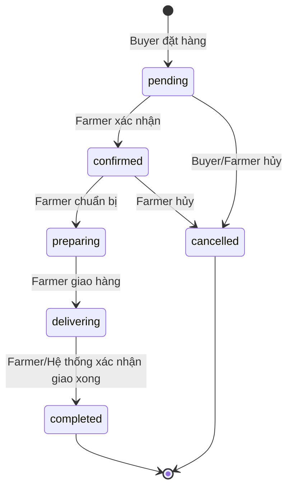
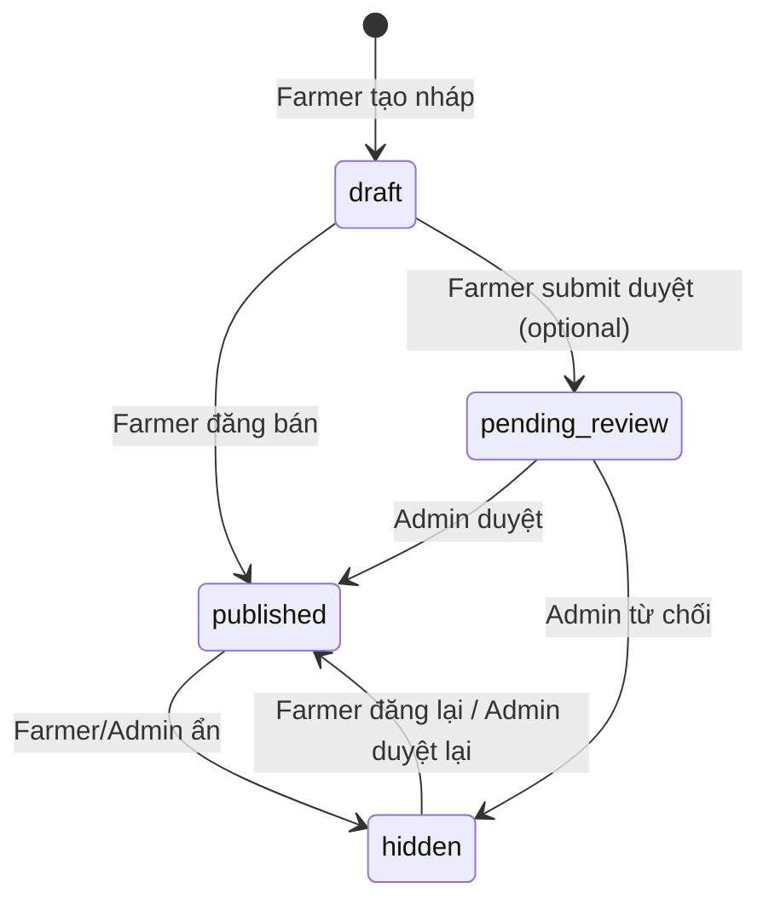

# Kiểm Tra Toàn Diện Frontend FarmTrace & Đặc Tả Backend Cho Codex

## Phần A — Đánh Giá Toàn Diện Frontend (d:\farm_shopping)

### 1. Tổng Quan Kiến Trúc

| Thuộc tính | Giá trị |
|---|---|
| **Tên dự án** | FarmTrace — Sàn thương mại nông sản có truy xuất nguồn gốc |
| **Kiến trúc** | Modular Monolith (module theo business domain) |
| **Tech Stack** | React 19, TypeScript 5.8, Vite 6, Tailwind CSS 4, Zustand 5, React Router 7, Motion 12, Lucide React |
| **Trạng thái** | Frontend-only MVP — toàn bộ dữ liệu là mock, auth không persist |
| **Ngôn ngữ UI** | Tiếng Việt |

### 2. Cấu Trúc Module

```
src/
├── modules/
│   ├── auth/          # Login, Register, Profile + AuthStore
│   ├── catalog/       # Home, ProductList, ProductDetail, FarmList, FarmDetail, Traceability + ProductStore
│   ├── cart/          # Cart + CartStore
│   ├── orders/        # Checkout, MyOrders, OrderDetail (buyer side)
│   ├── seller/        # Dashboard, ProductList, CreateEditProduct, ProductDetail, Orders, OrderDetail
│   └── admin/         # Dashboard, Products (moderation), Users
├── shared/
│   ├── components/ui/    # Button, Card, Badge, Input
│   ├── components/layout/ # PublicLayout, DashboardLayout, AppHeader, AppFooter
│   ├── types/index.ts     # Tất cả domain types
│   ├── data/mock.ts       # Seed data
│   └── utils/helpers.ts   # cn(), formatCurrency(), formatDate()
└── routes/index.tsx       # Router + ProtectedRoute
```

### 3. Domain Types Hiện Tại

```typescript
// Frontend roles (hiện tại)
Role = 'guest' | 'buyer' | 'seller' | 'admin'

// Backend roles (repo chính — PredefinedRole.java)
// ADMIN, FARMER, EMPLOYEE
// Mapping: frontend 'seller' ↔ backend 'FARMER'
//          frontend 'buyer'  ↔ backend 'FARMER' hoặc user bất kỳ có tài khoản
//          frontend 'admin'  ↔ backend 'ADMIN'

User       { id, name, email, role, avatar?, phone?, bio?, region?, farmId?, status? }
Address    { id, userId, fullName, phone, province, district, ward, street, detail?, isDefault, label }
Farm       { id, name, ownerId, region, address, description, image }
Season     { id, farmId, name, cropType, startDate, endDate, status }
Lot        { id, seasonId, code, harvestDate, quantity, status }
Product    { id, name, slug, category, description, shortDescription, price, unit, stock,
             images[], farmerId, farmId, seasonId, lotId, region, traceable,
             rating, reviewCount, createdAt, updatedAt?, status }
CartItem   { id, productId, quantity }
OrderItem  { productId, quantity, price }
OrderStatus = 'pending'|'confirmed'|'preparing'|'delivering'|'completed'|'cancelled'
Order      { id, buyerId, farmerId, items[], total, shippingFee, status, address, phone,
             paymentMethod, createdAt }
Review     { id, productId, userId, rating, comment, createdAt }
```

### 4. State Management (Zustand Stores)

| Store | File | Chức năng |
|---|---|---|
| `useAuthStore` | `modules/auth/store.ts` | user, isAuthenticated, addresses, login/logout, CRUD address, updateProfile |
| `useProductStore` | `modules/catalog/store.ts` | products[], CRUD product, getFarmerProducts, toggleStatus |
| `useCartStore` | `modules/cart/store.ts` | items[], add/remove/update/clear, getTotal (đọc productStore) |

> [!WARNING]
> **Không có OrderStore** — Tất cả orders page đọc trực tiếp từ `mockOrders`. Khi kết nối backend, cần tạo thêm `useOrderStore` hoặc dùng React Query/SWR để fetch từ API.

### 5. Route Map & Role Guard

| Path | Module | Role | Phương thức bảo vệ |
|---|---|---|---|
| `/` `/products` `/products/:slug` `/farms` `/farms/:id` `/traceability` `/login` `/register` `/cart` | catalog/auth/cart | public | Không |
| `/checkout` `/orders` `/orders/:id` `/profile` | orders/auth | buyer+ | `ProtectedRoute` (isAuthenticated) |
| `/seller/*` (7 routes) | seller | FARMER | `ProtectedRoute allowedRoles=['seller']` → backend map sang `FARMER` |
| `/admin/*` (4 routes) | admin | ADMIN | `ProtectedRoute allowedRoles=['admin']` → backend map sang `ADMIN` |

---

### 6. Vấn Đề & Gap Phát Hiện

#### 6.1 Vấn đề nghiêm trọng (Critical)

| # | Vấn đề | File | Ảnh hưởng |
|---|---|---|---|
| C1 | **Checkout không tạo Order thực** — chỉ `alert()` rồi `clearCart()`, không ghi vào bất kỳ store nào | `orders/pages/Checkout.tsx:42` | Đơn hàng không được lưu/hiển thị |
| C2 | **MyOrders & OrderDetail đọc trực tiếp `mockOrders`** — không liên kết với user hiện tại | `orders/pages/MyOrders.tsx:10` | Mọi user thấy cùng orders |
| C3 | **Farmer Dashboard hardcode `sellerId = 'u2'`** — cần đổi thành lấy từ auth user | `seller/pages/Dashboard.tsx:7` | Farmer khác sẽ thấy dữ liệu sai |
| C4 | **Farmer Orders hardcode `sellerId = 'u2'`** | `seller/pages/Orders.tsx:9` | Tương tự C3 |
| C5 | **Farmer OrderDetail cập nhật status chỉ local state** — không persist | `seller/pages/OrderDetail.tsx:20` | Status reset khi navigation |
| C6 | **Admin Products moderation buttons không có handler thực** | `admin/pages/Products.tsx:42-47` | Nút "Duyệt"/"Từ chối" không làm gì |
| C7 | **Cart Store cross-module import** — `cart/store.ts` import thẳng `../catalog/store` | `cart/store.ts:3` | Vi phạm module boundary (được ghi nhận là exception) |

#### 6.2 Vấn đề trung bình (Medium)

| # | Vấn đề | File |
|---|---|---|
| M1 | **Checkout import `mockProducts`** thay vì dùng `useProductStore` | `orders/pages/Checkout.tsx:5` |
| M2 | **Traceability checkbox filter không hoạt động** — không có state/handler | `catalog/pages/ProductList.tsx:58` |
| M3 | **Header search không hoạt động** — input không có state/handler | `layout/AppHeader.tsx:35-39` |
| M4 | **Header link `/about`** không có route tương ứng → sẽ 404 | `layout/AppHeader.tsx:28` |
| M5 | **Seller Dashboard "Lượt xem" hardcode `1,234`** | `seller/pages/Dashboard.tsx:65` |
| M6 | **Admin Users không có action** (ban/unban/edit) | `admin/pages/Users.tsx` |
| M7 | **Review hiện không hiển thị ở ProductDetail** — chỉ đếm rating/reviewCount | `catalog/pages/ProductDetail.tsx` |
| M8 | **`formatDate` có thể lỗi với undefined** — `SellerProductDetail` line 138 gọi `formatDate(product.updatedAt)` nhưng `updatedAt` optional | `seller/pages/SellerProductDetail.tsx:138` |

#### 6.3 Vấn đề nhỏ (Low)

| # | Vấn đề |
|---|---|
| L1 | `package.json` name vẫn là `react-example` |
| L2 | README mô tả cấu trúc cũ (`src/components`, `src/pages`) không khớp thực tế |
| L3 | Không có error boundary |
| L4 | Không có loading states / skeleton UI |
| L5 | Không có pagination cho product list |
| L6 | Chưa có i18n chuẩn — text tiếng Việt hardcode |

---

## Phần B — Đặc Tả Backend REST API Cho Codex

> [!IMPORTANT]
> Tài liệu này được thiết kế để cung cấp cho **Codex** ở repo chính (Spring Boot) để implement backend cho sàn thương mại và tích hợp với frontend FarmTrace.

### 1. Tổng Quan Tích Hợp

**Frontend FarmTrace** (repo `farm_shopping`) là một React SPA hiện đang dùng mock data. Backend cần cung cấp REST API tương thích để frontend chỉ cần thay thế mock data bằng API calls.

**Nguyên tắc tích hợp:**
- Base URL: `${API_BASE_URL}/api/v1/marketplace` (prefix tách biệt khỏi các module FDN/Sustainability hiện có)
- Authentication: JWT Bearer token (tái sử dụng hệ thống auth hiện có trong repo chính)
- Content-Type: `application/json`
- Response format: `{ data: T, message: string, status: number }` (wrapper chuẩn)
- Vietnamese error messages
- Pagination: `?page=0&size=20&sort=createdAt,desc`

> [!IMPORTANT]
> **Bảng Mapping Role giữa Frontend ↔ Backend:**
>
> | Frontend (FarmTrace) | Backend (PredefinedRole.java) | Ghi chú |
> |---|---|---|
> | `seller` | `FARMER` | Farmer chính là người bán nông sản |
> | `admin` | `ADMIN` | Quản trị hệ thống |
> | `buyer` | Authenticated user (bất kỳ role) | Mọi user đăng nhập đều có thể mua hàng |
> | — | `EMPLOYEE` | Nhân viên — không dùng trong marketplace |
>
> **Lưu ý**: Frontend dùng từ "seller" trong code (route `/seller/*`, component SellerDashboard...) nhưng về mặt nghiệp vụ, đây chính là **FARMER** — nông dân vừa trồng vừa bán. Backend PHẢI dùng role `FARMER` từ `PredefinedRole.FARMER_ROLE`.

### 2. Database Schema

> [!NOTE]
> Các bảng dưới đây cần tương thích với schema hiện có trong repo chính. Dùng Flyway migration file `V12__marketplace_schema.sql` (hoặc số version tiếp theo).

#### 2.1 Bảng `marketplace_products`

```sql
CREATE TABLE marketplace_products (
    id              BIGSERIAL PRIMARY KEY,
    name            VARCHAR(255)  NOT NULL,
    slug            VARCHAR(255)  NOT NULL UNIQUE,
    category        VARCHAR(100)  NOT NULL,
    description     TEXT,
    short_description VARCHAR(500),
    price           DECIMAL(15,2) NOT NULL CHECK (price > 0),
    unit            VARCHAR(50)   NOT NULL DEFAULT 'kg',
    stock           INT           NOT NULL DEFAULT 0 CHECK (stock >= 0),
    images          TEXT[],       -- PostgreSQL array hoặc JSON
    farmer_id       BIGINT        NOT NULL REFERENCES users(id),  -- FARMER role = người bán
    farm_id         BIGINT        REFERENCES farms(id),       -- nullable nếu không traceable
    season_id       BIGINT        REFERENCES seasons(id),
    lot_id          BIGINT        REFERENCES lots(id),
    region          VARCHAR(100),
    traceable       BOOLEAN       NOT NULL DEFAULT FALSE,
    rating          DECIMAL(3,2)  DEFAULT 0,
    review_count    INT           DEFAULT 0,
    status          VARCHAR(20)   NOT NULL DEFAULT 'draft'
                    CHECK (status IN ('draft', 'published', 'hidden', 'pending_review')),
    created_at      TIMESTAMP     NOT NULL DEFAULT NOW(),
    updated_at      TIMESTAMP     DEFAULT NOW()
);

CREATE INDEX idx_mp_farmer_id ON marketplace_products(farmer_id);
CREATE INDEX idx_mp_status ON marketplace_products(status);
CREATE INDEX idx_mp_category ON marketplace_products(category);
CREATE INDEX idx_mp_slug ON marketplace_products(slug);
```

#### 2.2 Bảng `marketplace_orders`

```sql
CREATE TABLE marketplace_orders (
    id              BIGSERIAL PRIMARY KEY,
    order_code      VARCHAR(20)   NOT NULL UNIQUE, -- VD: ORD-20260418-001
    buyer_id        BIGINT        NOT NULL REFERENCES users(id),
    farmer_id       BIGINT        NOT NULL REFERENCES users(id),  -- FARMER role = người bán
    total           DECIMAL(15,2) NOT NULL,
    shipping_fee    DECIMAL(15,2) NOT NULL DEFAULT 0,
    status          VARCHAR(20)   NOT NULL DEFAULT 'pending'
                    CHECK (status IN ('pending','confirmed','preparing','delivering','completed','cancelled')),
    shipping_address TEXT         NOT NULL,
    shipping_phone  VARCHAR(20)   NOT NULL,
    shipping_name   VARCHAR(255),
    note            TEXT,
    payment_method  VARCHAR(30)   NOT NULL DEFAULT 'COD'
                    CHECK (payment_method IN ('COD', 'BANK_TRANSFER')),
    payment_status  VARCHAR(20)   NOT NULL DEFAULT 'unpaid'
                    CHECK (payment_status IN ('unpaid', 'paid', 'refunded')),
    cancel_reason   TEXT,
    created_at      TIMESTAMP     NOT NULL DEFAULT NOW(),
    updated_at      TIMESTAMP     DEFAULT NOW()
);

CREATE INDEX idx_mo_buyer_id ON marketplace_orders(buyer_id);
CREATE INDEX idx_mo_farmer_id ON marketplace_orders(farmer_id);
CREATE INDEX idx_mo_status ON marketplace_orders(status);
```

#### 2.3 Bảng `marketplace_order_items`

```sql
CREATE TABLE marketplace_order_items (
    id              BIGSERIAL PRIMARY KEY,
    order_id        BIGINT        NOT NULL REFERENCES marketplace_orders(id) ON DELETE CASCADE,
    product_id      BIGINT        NOT NULL REFERENCES marketplace_products(id),
    product_name    VARCHAR(255)  NOT NULL, -- snapshot tại thời điểm đặt
    product_image   TEXT,                   -- snapshot
    quantity        INT           NOT NULL CHECK (quantity > 0),
    unit_price      DECIMAL(15,2) NOT NULL,
    subtotal        DECIMAL(15,2) NOT NULL
);

CREATE INDEX idx_moi_order_id ON marketplace_order_items(order_id);
```

#### 2.4 Bảng `marketplace_reviews`

```sql
CREATE TABLE marketplace_reviews (
    id              BIGSERIAL PRIMARY KEY,
    product_id      BIGINT    NOT NULL REFERENCES marketplace_products(id),
    user_id         BIGINT    NOT NULL REFERENCES users(id),
    order_id        BIGINT    REFERENCES marketplace_orders(id), -- liên kết đơn hàng
    rating          INT       NOT NULL CHECK (rating BETWEEN 1 AND 5),
    comment         TEXT,
    created_at      TIMESTAMP NOT NULL DEFAULT NOW(),
    UNIQUE(product_id, user_id, order_id) -- mỗi đơn hàng chỉ đánh giá 1 lần per product
);

CREATE INDEX idx_mr_product_id ON marketplace_reviews(product_id);
```

#### 2.5 Bảng `marketplace_addresses`

```sql
CREATE TABLE marketplace_addresses (
    id              BIGSERIAL PRIMARY KEY,
    user_id         BIGINT        NOT NULL REFERENCES users(id),
    full_name       VARCHAR(255)  NOT NULL,
    phone           VARCHAR(20)   NOT NULL,
    province        VARCHAR(100)  NOT NULL,
    district        VARCHAR(100)  NOT NULL,
    ward            VARCHAR(100)  NOT NULL,
    street          VARCHAR(255)  NOT NULL,
    detail          TEXT,
    is_default      BOOLEAN       NOT NULL DEFAULT FALSE,
    label           VARCHAR(20)   NOT NULL DEFAULT 'home'
                    CHECK (label IN ('home', 'office', 'other')),
    created_at      TIMESTAMP     NOT NULL DEFAULT NOW()
);

CREATE INDEX idx_ma_user_id ON marketplace_addresses(user_id);
```

#### 2.6 Bảng `marketplace_cart_items`
*(Optional — cart có thể client-side-only hoặc server-side)*

```sql
CREATE TABLE marketplace_cart_items (
    id              BIGSERIAL PRIMARY KEY,
    user_id         BIGINT    NOT NULL REFERENCES users(id),
    product_id      BIGINT    NOT NULL REFERENCES marketplace_products(id),
    quantity        INT       NOT NULL DEFAULT 1 CHECK (quantity > 0),
    created_at      TIMESTAMP NOT NULL DEFAULT NOW(),
    UNIQUE(user_id, product_id)
);
```

---

### 3. REST API Endpoints

#### 3.1 Authentication (Tái sử dụng từ hệ thống hiện có)

Frontend cần các endpoint:

```
POST   /api/v1/auth/login          { email, password }       → { token, user }
POST   /api/v1/auth/register       { name, email, password, role }  → { token, user }
GET    /api/v1/auth/me             (Bearer token)            → { user }
PUT    /api/v1/auth/profile        { name, phone, bio, ... } → { user }
```

> [!IMPORTANT]
> **Role mapping khi auth:**
> - Repo chính có `PredefinedRole`: `ADMIN`, `FARMER`, `EMPLOYEE`
> - Frontend gửi role `seller` khi register → backend map thành `FARMER`
> - Frontend gửi role `buyer` → backend có thể dùng `FARMER` hoặc tạo thêm role `BUYER` nếu cần phân biệt
> - Response API trả về user object nên chứa field `role` đã map ngược cho frontend hiểu (`FARMER` → `seller` trong response)

---

#### 3.2 Catalog API (Public)

```
GET    /api/v1/marketplace/products
       Query params: ?page=0&size=20&category=Rau+củ&region=Lâm+Đồng
                     &search=cà+chua&traceable=true&sort=price,asc
       Response: Page<ProductDTO>

GET    /api/v1/marketplace/products/{slug}
       Response: ProductDetailDTO (kèm farm, season, lot nếu traceable)

GET    /api/v1/marketplace/categories
       Response: string[]   (danh sách category distinct)

GET    /api/v1/marketplace/farms
       Response: FarmDTO[]

GET    /api/v1/marketplace/farms/{id}
       Response: FarmDetailDTO (kèm products[])

GET    /api/v1/marketplace/products/{productId}/reviews
       Query params: ?page=0&size=10
       Response: Page<ReviewDTO>
```

**ProductDTO:**
```json
{
  "id": "string",
  "name": "string",
  "slug": "string",
  "category": "string",
  "shortDescription": "string",
  "price": 45000,
  "unit": "kg",
  "stock": 150,
  "images": ["url1"],
  "farmerId": "string",
  "farmId": "string",
  "region": "string",
  "traceable": true,
  "rating": 4.8,
  "reviewCount": 124,
  "createdAt": "2024-01-20T10:00:00Z",
  "status": "published"
}
```

**ProductDetailDTO** (extends ProductDTO):
```json
{
  "...ProductDTO fields",
  "description": "string",
  "seasonId": "string",
  "lotId": "string",
  "updatedAt": "...",
  "farm": { "id", "name", "region", "address", "description", "image" },
  "season": { "id", "name", "cropType", "startDate", "endDate", "status" },
  "lot": { "id", "code", "harvestDate", "quantity", "status" },
  "farmer": { "id", "name", "avatar" }
}
```

---

#### 3.3 Cart API (Authenticated — any logged-in user)

```
GET    /api/v1/marketplace/cart
       Response: CartDTO { items: CartItemDTO[], total: number }

POST   /api/v1/marketplace/cart/items
       Body: { productId: "string", quantity: 1 }
       Response: CartItemDTO
       Logic: nếu đã có → cộng quantity; validate stock

PUT    /api/v1/marketplace/cart/items/{productId}
       Body: { quantity: 5 }
       Response: CartItemDTO

DELETE /api/v1/marketplace/cart/items/{productId}
       Response: 204 No Content

DELETE /api/v1/marketplace/cart
       Response: 204 No Content (clear all)
```

**CartItemDTO:**
```json
{
  "id": "string",
  "productId": "string",
  "quantity": 2,
  "product": {
    "name": "string",
    "price": 45000,
    "unit": "kg",
    "images": ["url"],
    "slug": "string",
    "stock": 150
  }
}
```

---

#### 3.4 Order API (Authenticated — any logged-in user / buyer)

```
POST   /api/v1/marketplace/orders
       Body: {
         "addressId": "string",         // hoặc inline address
         "paymentMethod": "COD",
         "note": "string?"
       }
       Response: OrderDTO
       Logic:
         1. Validate cart không rỗng
         2. Validate stock cho từng item
         3. Tính total = sum(item.price * item.quantity)
         4. Tính shippingFee theo logic (VD: cố định 30000 hoặc theo khoảng cách)
         5. Trừ stock sản phẩm
         6. Tạo order + order_items (snapshot giá/tên)
         7. Xóa cart
         8. Group items theo farmerId → tạo nhiều orders nếu multi-farmer

GET    /api/v1/marketplace/orders
       Query: ?page=0&size=10&status=pending
       Response: Page<OrderDTO> (của buyer đang đăng nhập)

GET    /api/v1/marketplace/orders/{id}
       Response: OrderDetailDTO

PUT    /api/v1/marketplace/orders/{id}/cancel
       Body: { reason?: "string" }
       Response: OrderDTO
       Logic: chỉ cancel khi status = pending; hoàn stock
```

**OrderDTO:**
```json
{
  "id": "string",
  "orderCode": "ORD-20260418-001",
  "buyerId": "string",
  "farmerId": "string",
  "items": [
    { "productId": "string", "productName": "...", "productImage": "...",
      "quantity": 2, "unitPrice": 45000, "subtotal": 90000 }
  ],
  "total": 125000,
  "shippingFee": 30000,
  "status": "pending",
  "address": "string",
  "phone": "string",
  "paymentMethod": "COD",
  "createdAt": "...",
  "farmerName": "..."
}
```

---

#### 3.5 Review API (Authenticated — buyer/user đã mua)

```
POST   /api/v1/marketplace/products/{productId}/reviews
       Body: { orderId: "string", rating: 5, comment: "string" }
       Response: ReviewDTO
       Logic:
         1. Validate order completed + buyer đúng
         2. Validate chưa review sản phẩm trong order này
         3. Tạo review → update product.rating + product.reviewCount

GET    /api/v1/marketplace/products/{productId}/reviews
       (đã liệt kê ở Catalog API)
```

---

#### 3.6 Address API (Authenticated)

```
GET    /api/v1/marketplace/addresses
       Response: AddressDTO[]

POST   /api/v1/marketplace/addresses
       Body: { fullName, phone, province, district, ward, street, detail?, isDefault, label }
       Response: AddressDTO
       Logic: nếu isDefault=true → bỏ default cũ

PUT    /api/v1/marketplace/addresses/{id}
       Body: Partial<AddressDTO>
       Response: AddressDTO

DELETE /api/v1/marketplace/addresses/{id}
       Response: 204
       Logic: nếu xóa default → set address đầu tiên còn lại thành default

PUT    /api/v1/marketplace/addresses/{id}/default
       Response: AddressDTO
```

---

#### 3.7 Farmer API (Authenticated — role FARMER)

> **Lưu ý**: Frontend gọi đây là "seller" nhưng backend dùng role `FARMER`. API path dùng `/farmer/` để thống nhất.

```
GET    /api/v1/marketplace/farmer/dashboard
       Response: FarmerDashboardDTO {
         totalRevenue, pendingOrders, totalProducts, productCount,
         recentOrders[], lowStockProducts[]
       }

GET    /api/v1/marketplace/farmer/products
       Query: ?page=0&size=20&status=published&search=...
       Response: Page<ProductDTO>

POST   /api/v1/marketplace/farmer/products
       Body: CreateProductRequest (multipart/form-data cho images)
       Response: ProductDTO
       Logic: auto set farmerId = currentUser.id (user có role FARMER)

GET    /api/v1/marketplace/farmer/products/{id}
       Response: ProductDetailDTO (validate farmer ownership)

PUT    /api/v1/marketplace/farmer/products/{id}
       Body: UpdateProductRequest
       Response: ProductDTO

DELETE /api/v1/marketplace/farmer/products/{id}
       Response: 204

PUT    /api/v1/marketplace/farmer/products/{id}/status
       Body: { status: "published" | "hidden" | "draft" }
       Response: ProductDTO

GET    /api/v1/marketplace/farmer/orders
       Query: ?page=0&size=20&status=pending
       Response: Page<OrderDTO>

GET    /api/v1/marketplace/farmer/orders/{id}
       Response: OrderDetailDTO

PUT    /api/v1/marketplace/farmer/orders/{id}/status
       Body: { status: "confirmed" | "preparing" | "delivering" | "completed" | "cancelled" }
       Response: OrderDTO
       Logic: validate transition hợp lệ:
         pending → confirmed/cancelled
         confirmed → preparing/cancelled
         preparing → delivering
         delivering → completed
```

---

#### 3.8 Admin API (Authenticated — admin)

```
GET    /api/v1/marketplace/admin/dashboard
       Response: AdminDashboardDTO {
         totalUsers, totalFarmers, pendingProducts, totalOrders,
         recentUsers[], pendingReviewProducts[]
       }

GET    /api/v1/marketplace/admin/products
       Query: ?page=0&size=20&status=pending_review
       Response: Page<ProductDTO>

PUT    /api/v1/marketplace/admin/products/{id}/approve
       Response: ProductDTO (status → published)

PUT    /api/v1/marketplace/admin/products/{id}/reject
       Body: { reason: "string" }
       Response: ProductDTO (status → hidden)

GET    /api/v1/marketplace/admin/users
       Query: ?page=0&size=20&role=FARMER&search=...
       Response: Page<UserDTO>

PUT    /api/v1/marketplace/admin/users/{id}/status
       Body: { status: "active" | "inactive" | "banned" }
       Response: UserDTO
```

---

### 4. Business Rules & Logic

#### 4.1 Order Status Machine



#### 4.2 Product Status Machine



#### 4.3 Checkout Business Logic

```
1. Buyer submit checkout request
2. Server validate:
   a. Cart không rỗng
   b. Tất cả products có status = 'published'
   c. Stock >= quantity cho mỗi item
   d. Address hợp lệ
3. Group cart items theo farmerId → N orders nếu N farmers
4. Cho mỗi order:
   a. Snapshot: tên product, giá, ảnh tại thời điểm đặt
   b. Tính subtotal = price × quantity
   c. Tínhtotal = sum(subtotals)
   d. Tính shippingFee (cố định 30000 VND hoặc theo config)
   e. Trừ stock product
   f. Status = 'pending'
   g. Payment = 'unpaid'
5. Xóa cart items
6. Return danh sách orders đã tạo
```

#### 4.4 Rating Calculation

```
Khi có review mới cho product:
  new_avg = (old_rating * old_count + new_rating) / (old_count + 1)
  product.rating = round(new_avg, 2)
  product.reviewCount = old_count + 1
```

#### 4.5 Stock Management

| Sự kiện | Hành động |
|---|---|
| Checkout thành công | `stock -= quantity` |
| Order cancelled (status pending/confirmed) | `stock += quantity` |
| Farmer update stock | Direct set |

---

### 5. Mapping Frontend Store → Backend API

Bảng dưới cho thấy cách frontend cần thay đổi khi kết nối backend:

| Frontend Source | Hiện tại (Mock) | Backend API thay thế |
|---|---|---|
| `useAuthStore.login()` | Match mockUsers | `POST /auth/login` → set JWT |
| `useProductStore.products` | `mockProducts` | `GET /marketplace/products` |
| `useProductStore.createProduct()` | In-memory push | `POST /marketplace/farmer/products` |
| `useCartStore.addItem()` | Local state | `POST /marketplace/cart/items` |
| `useCartStore.getTotal()` | Cross-store read | `GET /marketplace/cart` (server compute) |
| `Checkout.handleSubmit()` | `alert()` | `POST /marketplace/orders` |
| `MyOrders` orders | `mockOrders` | `GET /marketplace/orders` |
| `FarmerOrders` | `mockOrders.filter(farmerId)` | `GET /marketplace/farmer/orders` |
| `AdminProducts Approve/Reject` | No handler | `PUT /marketplace/admin/products/{id}/approve\|reject` |
| `AdminUsers` | Read-only display | `GET /marketplace/admin/users` + `PUT .../status` |

---

### 6. Cấu Trúc Backend Được Đề Xuất (Spring Boot)

```
src/main/java/org/example/QuanLyMuaVu/marketplace/
├── controller/
│   ├── MarketplaceProductController.java    // Public product/catalog endpoints
│   ├── MarketplaceCartController.java       // Cart CRUD
│   ├── MarketplaceOrderController.java      // Buyer order endpoints
│   ├── MarketplaceReviewController.java     // Product reviews
│   ├── MarketplaceAddressController.java    // Address management
│   ├── MarketplaceFarmerController.java     // Farmer (seller) dashboard, products, orders
│   └── MarketplaceAdminController.java      // Admin moderation
├── service/
│   ├── MarketplaceProductService.java
│   ├── MarketplaceCartService.java
│   ├── MarketplaceOrderService.java
│   ├── MarketplaceReviewService.java
│   ├── MarketplaceAddressService.java
│   └── MarketplaceStatisticsService.java    // Dashboard data
├── repository/
│   ├── MarketplaceProductRepository.java
│   ├── MarketplaceOrderRepository.java
│   ├── MarketplaceOrderItemRepository.java
│   ├── MarketplaceReviewRepository.java
│   ├── MarketplaceAddressRepository.java
│   └── MarketplaceCartItemRepository.java
├── dto/
│   ├── request/
│   │   ├── CreateProductRequest.java
│   │   ├── UpdateProductRequest.java
│   │   ├── CreateOrderRequest.java
│   │   ├── CreateReviewRequest.java
│   │   ├── CreateAddressRequest.java
│   │   └── StatusUpdateRequest.java
│   └── response/
│       ├── ProductDTO.java
│       ├── ProductDetailDTO.java
│       ├── CartDTO.java
│       ├── OrderDTO.java
│       ├── ReviewDTO.java
│       ├── AddressDTO.java
│       ├── FarmerDashboardDTO.java
│       └── AdminDashboardDTO.java
├── entity/
│   ├── MarketplaceProduct.java
│   ├── MarketplaceOrder.java
│   ├── MarketplaceOrderItem.java
│   ├── MarketplaceReview.java
│   ├── MarketplaceAddress.java
│   └── MarketplaceCartItem.java
├── mapper/
│   └── MarketplaceMapper.java               // Entity ↔ DTO mapping
├── exception/
│   ├── InsufficientStockException.java
│   ├── InvalidOrderStatusTransitionException.java
│   └── ProductNotFoundException.java
└── config/
    └── MarketplaceCorsConfig.java           // CORS cho frontend port 3000
```

---

### 7. Cấu Hình CORS & Security

```yaml
# application.yml - thêm vào config hiện tại
marketplace:
  cors:
    allowed-origins:
      - http://localhost:3000
      - http://localhost:5173
    allowed-methods: GET,POST,PUT,DELETE,OPTIONS
    allowed-headers: "*"
    allow-credentials: true

  shipping:
    default-fee: 30000    # VND
    free-threshold: 500000 # miễn phí khi đơn > 500k

  order:
    auto-complete-after-days: 7  # tự hoàn thành sau 7 ngày giao
```

**Spring Security config:**
```java
// Thêm vào SecurityConfig hiện tại
// Sử dụng PredefinedRole constants: ADMIN_ROLE, FARMER_ROLE, EMPLOYEE_ROLE
.requestMatchers("/api/v1/marketplace/products/**").permitAll()
.requestMatchers("/api/v1/marketplace/farms/**").permitAll()
.requestMatchers("/api/v1/marketplace/categories").permitAll()
.requestMatchers("/api/v1/marketplace/cart/**").authenticated()     // Mọi user đăng nhập đều có thể mua
.requestMatchers("/api/v1/marketplace/orders/**").authenticated()   // Mọi user đăng nhập đều có thể đặt hàng
.requestMatchers("/api/v1/marketplace/addresses/**").authenticated()
.requestMatchers("/api/v1/marketplace/farmer/**").hasRole(PredefinedRole.FARMER_ROLE)  // "FARMER"
.requestMatchers("/api/v1/marketplace/admin/**").hasRole(PredefinedRole.ADMIN_ROLE)    // "ADMIN"
```

---

### 8. Flyway Migration Script

```sql
-- V12__marketplace_schema.sql (or next version number)

-- Thực thi tất cả CREATE TABLE từ Section 2 ở trên
-- Thêm seed data cho testing:

INSERT INTO marketplace_products (name, slug, category, ...) VALUES
  ('Cà chua Cherry VietGAP', 'ca-chua-cherry-vietgap', 'Rau củ', ...),
  ('Sầu riêng Ri6', 'sau-rieng-ri6', 'Trái cây', ...),
  ('Xà lách thủy canh', 'xa-lach-thuy-canh', 'Rau củ', ...);
```

---

### 9. Tích Hợp Với Hệ Thống Hiện Có (Repo Chính)

> [!IMPORTANT]
> Điểm quan trọng khi Codex implement:

#### 9.1 Tái sử dụng từ repo chính
- **Users/Auth**: Dùng `User` entity và `AuthService` hiện có
- **Roles**: Dùng `PredefinedRole.FARMER_ROLE` cho farmer/seller. **KHÔNG tạo role mới `SELLER`**
- **Farm entity**: Nếu đã có Farm trong FDN module → tái sử dụng, không duplicate
- **Season/Lot**: Tương tự — chỉ reference, không tạo mới

#### 9.2 Liên kết FDN ↔ Marketplace
- Sản phẩm trên Marketplace có thể liên kết với Season/Lot từ FDN module
- Traceability data (Farm → Season → Lot → Product) đã có trong FDN schema
- Cần mapping: `marketplace_products.farm_id → farms.id` (bảng FDN)
- `marketplace_products.farmer_id` → user có role `FARMER`

#### 9.3 AI Assistant tích hợp
- Trợ lý ảo có thể gợi ý sản phẩm marketplace dựa trên dữ liệu mùa vụ FDN
- VD: "Mùa vụ lúa sắp thu hoạch → gợi ý farmer đăng sản phẩm gạo mới"

---

### 10. Frontend API Client Cần Tạo

Khi backend sẵn sàng, frontend cần tạo:

```
src/shared/
├── api/
│   ├── client.ts          # Axios/fetch wrapper với JWT interceptor
│   ├── auth-api.ts        # Login, register, profile
│   ├── product-api.ts     # Catalog CRUD
│   ├── cart-api.ts        # Cart operations
│   ├── order-api.ts       # Order CRUD
│   ├── review-api.ts      # Reviews
│   ├── address-api.ts     # Address CRUD
│   ├── farmer-api.ts      # Farmer (seller) operations
│   └── admin-api.ts       # Admin operations
└── hooks/
    ├── use-products.ts    # React Query hooks
    ├── use-cart.ts
    ├── use-orders.ts
    └── ...
```

---

## Phần C — Tóm Tắt Hành Động

### Cho Codex (Repo chính — Backend):

1. **Tạo Flyway migration** `V12__marketplace_schema.sql` với schema từ Section 2
2. **Implement entities** cho 6 bảng marketplace
3. **Implement 8 controllers** với endpoints từ Section 3
4. **Implement services** với business logic từ Section 4
5. **Configure CORS** để cho phép frontend localhost:3000
6. **Tái sử dụng** User/Farm/Season/Lot entity hiện có
7. **Viết unit tests** cho order creation, status transitions, stock management
8. **Seed sample data** tương thích với mock data frontend

### Cho Frontend (Repo farm_shopping):

1. **Fix critical bugs** C1-C7 (đặc biệt checkout flow và hardcoded seller IDs)
2. **Tạo API client layer** thay thế mock imports
3. **Thêm OrderStore** hoặc React Query
4. **Implement loading states** và error handling
5. **Fix broken features** (search, traceability filter, admin actions)

---

## Open Questions

> [!IMPORTANT]
> **Cần quyết định trước khi implement:**

1. **Multi-farmer order**: Frontend hiện giả định 1 order = 1 farmer. Nếu buyer mua từ 2 farmer → tạo 2 order riêng hay 1 order chung?
   - **Đề xuất**: 2 order riêng (đơn giản hơn, phù hợp mô hình marketplace)

2. **Image upload**: Dùng local storage hay cloud (S3/Firebase Storage)?
   - **Đề xuất**: Bắt đầu với local `/uploads/products/`, sau đó migrate lên cloud

3. **Shipping fee calculation**: Cố định hay tính theo khoảng cách/vùng miền?
   - **Đề xuất**: Cố định 30,000 VND (đồng bộ với frontend hiện tại)

4. **Product approval flow**: Farmer đăng thẳng `published` hay phải qua `pending_review` → Admin duyệt?
   - **Đề xuất**: Cho phép cả 2 mode (config trong `application.yml`)

5. **Payment integration**: Phase nào thêm thanh toán online (VNPAY/Momo)?
   - **Đề xuất**: Phase 2, hiện tại chỉ COD + Bank Transfer (manual)
